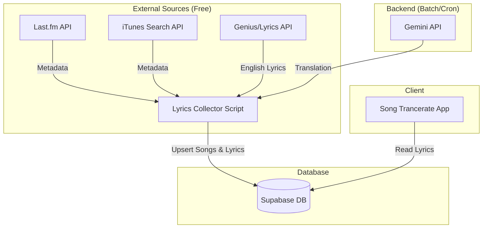

# Automated Lyrics Collection System - Design Document

## 1. Overview

This document outlines the architecture for an automated system to collect song lyrics (English original + Japanese translation) for "Song Trancerate".
The goal is to personalize the learning experience by automatically populating the database with lyrics from the user's favorite artists or new releases, minimizing manual data entry.

**Key Features:**

* **Automated Discovery**: Fetch metadata from **Last.fm** (User/Global Charts) or **iTunes Search API**.
* **Lyrics Fetching**: Retrieve English lyrics from external APIs (e.g., Genius, Musixmatch).
* **AI Translation**: Generate Japanese translations using Gemini API.
* **Database Storage**: Store structured data in Supabase for the client app to consume.

## 2. Architecture

## 3. Workflow (Batch Process)

This process is designed to run periodically (e.g., daily via GitHub Actions).

1. **Fetch Target Songs (Metadata)**:
    * **Option A: Last.fm (Recommended)**
        * `artist.getTopTracks`: Get popular songs by user's favorite artists.
        * `chart.getTopTracks`: Get global trending songs.
        * *Input*: Last.fm API Key (Free for non-commercial use).
    * **Option B: iTunes Search API (No Key)**
        * Search by Artist Name (from a config list).
        * *Input*: List of Artist Names.
    * *Output*: List of `(Title, Artist)`.

2. **Filter Existing**:
    * Query Supabase `songs` table.
    * Skip if lyrics already exist.

3. **Fetch English Lyrics**:
    * Search Lyrics Provider (e.g., Genius) using Title + Artist.
    * Clean up text (remove `[Verse]`, metadata tags if needed).
    * *Output*: `English Lyrics Text`.

4. **Translate (AI)**:
    * Send English Lyrics to Gemini 2.0 Flash.
    * Prompt: "Translate the following song lyrics into Japanese, preserving the rhythm and line structure where possible. Output JSON with `original` and `translated` arrays."
    * *Output*: `Japanese Lyrics Text`.

5. **Save to DB**:
    * Insert into `songs` table (if new).
    * Insert into `lyrics` table (`content_en`, `content_ja`).
    * Log success/failure.

## 4. Technology Stack & Cost

All selected technologies have verified **Free Tiers** suitable for personal use.

| Component | Technology | Cost / Limits |
| :--- | :--- | :--- |
| **Scripting** | TypeScript (Node.js) | Free (Runs on GitHub Actions) |
| **Scheduler** | GitHub Actions | **Free**: 2,000 minutes/month for private repositories. Sufficient for daily batch inputs. |
| **Metadata** | **Last.fm API** | **Free**: Requires API Key registration. Generous limits for personal use. |
| **Metadata (Alt)**| **iTunes Search API** | **Free**: No key required. Rate limited (~20 calls/min). |
| **Lyrics** | **Genius (via library)** | **Free**: Library scrapes Genius.com. Rate limited (sleep 2-5s between calls safe). |
| **Translation** | Gemini 2.0 Flash | **Free**: 15 requests per minute (RPM). Sufficient for batch processing if throttled. |
| **Database** | Supabase | **Free**: Generous tier (500MB DB). One project included. |

## 5. Schema Updates

Existing schema is mostly sufficient, but we will add metadata columns to track the source and status.

### `songs` Table

* No changes needed. `itunes_id` is already present. If using Last.fm, we can store `mbid` (MusicBrainz ID) in a new column or just matching metadata. Ideally mapping to iTunes ID via a quick search is best for album art consistency.

### `lyrics` Table

* Current: `content_en` (text), `content_ja` (text).
* **Additions**:
  * `source_url` (text): URL where lyrics were fetched from.
  * `fetched_at` (timestamp): Last update time.
  * `metadata` (jsonb): To store raw API response or translation confidence.

## 6. Implementation Steps

1. **Prototype Script (`scripts/collect-lyrics.ts`)**:
    * Hardcode a list of Artists (e.g., "Taylor Swift").
    * Fetch Top 5 songs using **Last.fm** or **iTunes**.
    * Fetch Lyrics (Genius) + Translate (Gemini).
    * Write to local file (dry run).
2. **DB Integration**:
    * Connect script to Supabase Service Role.
    * Implement Upsert logic.
3. **Automation**:
    * Create `.github/workflows/lyrics-collector.yml`.
    * Set up secrets (`LASTFM_API_KEY`, `GEMINI_API_KEY`, `SUPABASE_KEY`).

## 8. Client Integration Strategy (App Usage)

How the collected lyrics appear in the app:

1. **Automatic Reflection**:
    * The App's Song Page (`/songs/[id]`) checks the `songs` and `lyrics` tables by `itunes_id`.
    * Since the Batch System inserts directly into these tables, **collected lyrics will appear automatically**. Users do not need to do anything.
    * If a user searches for a song that the batch has already processed, they will see the lyrics immediately instead of the "Add Lyrics" prompt.
2. **Manual Override**:
    * If a user wants to edit the auto-collected lyrics (e.g., to fix a translation), we can add an "Edit" button to the `LyricsViewer` component in the future.
    * For now, the automated system simply "fills the gap" so users don't have to empty-start.
